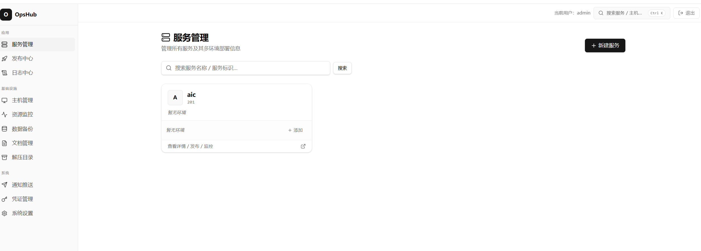
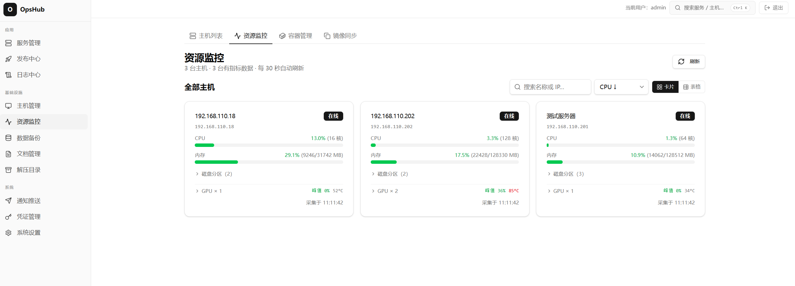

# OpsHub

OpsHub 是一个轻量级运维管理平台，用于统一管理服务、发布、主机、容器、日志和数据运维任务。





## 基础功能

- 服务及多环境配置
- Jenkins、SSH 和 Docker 发布，支持发布记录与回滚
- 主机与 SSH 凭证管理
- 远程容器查看、启停、重启及配置文件维护
- 主机间 Docker 镜像同步
- CPU、内存、磁盘及 NVIDIA GPU 资源监控
- PostgreSQL/MySQL 定时备份与手动数据库迁移
- S3 兼容对象存储同步
- Loki、远程文件及 Docker 日志检索
- 发布事件和资源阈值的邮件、企业微信机器人通知
- 文档上传、预览、下载及 Debian 软件包目录分析

## 技术架构

- 前端：React、TypeScript、Vite、Tailwind CSS、Zustand
- 后端：Go、Gin、GORM、PostgreSQL
- 基础设施：SSH/SFTP、Jenkins、Loki、Docker Compose
- 后端结构：Domain、Application、Infrastructure、Interfaces 分层

## 快速开始

复制配置示例并填写数据库及安全配置：

```bash
cp backend/configs/config.yaml.example backend/configs/config.yaml
```

准备容器运行目录并启动：

```bash
mkdir -p builder/data/configs builder/data/migrations
cp backend/configs/config.yaml builder/data/configs/config.yaml
cp -r backend/migrations/. builder/data/migrations/
docker compose -f builder/docker-compose.yml up -d
```

服务默认监听 `48884` 端口：

```text
http://localhost:48884
```

## 本地开发

```bash
cd backend
go test ./...
go run ./cmd/server
```

```bash
cd frontend
pnpm install --frozen-lockfile
pnpm run dev
```

## 配置安全

真实配置、密码、Token 和密钥不得提交到仓库。推荐通过 `OPSHUB_*` 环境变量或被 Git 忽略的 `config.yaml` 提供运行配置。
